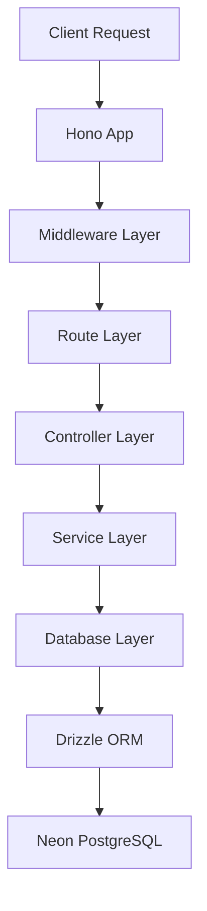

# Design Document

## Overview

This design restructures the current monolithic Hono API into a modular, maintainable architecture following separation of concerns principles. The new structure will organize code into logical layers: routes, controllers, services, and middleware, while maintaining the existing functionality and improving extensibility.

## Architecture

### High-Level Architecture



### Directory Structure

```
src/
├── index.ts                 # Application entry point
├── app.ts                   # Hono app configuration
├── config/
│   ├── database.ts          # Database connection setup
│   └── index.ts             # Configuration barrel export
├── middleware/
│   ├── error-handler.ts     # Global error handling
│   ├── validation.ts        # Request validation middleware
│   └── index.ts             # Middleware barrel export
├── routes/
│   ├── events.ts            # Event-related routes
│   ├── health.ts            # Health check routes
│   └── index.ts             # Routes barrel export
├── controllers/
│   ├── events.controller.ts # Event business logic
│   └── index.ts             # Controllers barrel export
├── services/
│   ├── events.service.ts    # Event data operations
│   └── index.ts             # Services barrel export
└── types/
    ├── api.ts               # API response types
    ├── events.ts            # Event-related types
    └── index.ts             # Types barrel export
```

## Components and Interfaces

### 1. Application Entry Point (`src/index.ts`)

**Purpose:** Minimal entry point that starts the server
**Responsibilities:**
- Import and configure the Hono app
- Set server port and export for Bun runtime

### 2. App Configuration (`src/app.ts`)

**Purpose:** Central Hono app setup and middleware registration
**Responsibilities:**
- Create Hono instance
- Register global middleware (CORS, error handling)
- Mount route handlers
- Configure 404 handling

### 3. Database Configuration (`src/config/database.ts`)

**Purpose:** Centralized database connection management
**Responsibilities:**
- Initialize Drizzle ORM connection
- Export database instance for services
- Handle connection configuration

### 4. Middleware Layer

#### Error Handler (`src/middleware/error-handler.ts`)
**Purpose:** Global error handling and response formatting
**Interface:**
```typescript
interface ApiError {
  status: number;
  message: string;
  details?: unknown;
}

interface ErrorResponse {
  error: string;
  message: string;
  details?: unknown;
}
```

#### Validation Middleware (`src/middleware/validation.ts`)
**Purpose:** Request validation using Zod schemas
**Interface:**
```typescript
interface ValidationOptions {
  body?: ZodSchema;
  params?: ZodSchema;
  query?: ZodSchema;
}
```

### 5. Route Layer (`src/routes/events.ts`)

**Purpose:** Define HTTP endpoints and route to controllers
**Responsibilities:**
- Define RESTful routes for events
- Apply validation middleware
- Route requests to appropriate controllers

**Endpoints:**
- `GET /api/events` - List all events
- `POST /api/events` - Create new event
- `GET /api/events/:id` - Get specific event
- `PUT /api/events/:id` - Update event
- `DELETE /api/events/:id` - Delete event

### 6. Controller Layer (`src/controllers/events.controller.ts`)

**Purpose:** Handle HTTP requests and responses
**Responsibilities:**
- Extract and validate request data
- Call appropriate service methods
- Format and return responses
- Handle controller-level errors

**Interface:**
```typescript
interface EventController {
  getAllEvents(c: Context): Promise<Response>;
  createEvent(c: Context): Promise<Response>;
  getEventById(c: Context): Promise<Response>;
  updateEvent(c: Context): Promise<Response>;
  deleteEvent(c: Context): Promise<Response>;
}
```

### 7. Service Layer (`src/services/events.service.ts`)

**Purpose:** Business logic and data operations
**Responsibilities:**
- Implement business rules
- Interact with database through Drizzle ORM
- Handle service-level errors
- Return typed data

**Interface:**
```typescript
interface EventService {
  findAll(): Promise<Event[]>;
  create(data: CreateEventData): Promise<Event>;
  findById(id: string): Promise<Event | null>;
  update(id: string, data: UpdateEventData): Promise<Event>;
  delete(id: string): Promise<void>;
}
```

## Data Models

### Event Types (`src/types/events.ts`)

```typescript
// Base event from database schema
export type Event = InferSelectModel<typeof events>;

// Create event request
export interface CreateEventRequest {
  id: string;
  name: string;
}

// Update event request
export interface UpdateEventRequest {
  name?: string;
}

// API response wrapper
export interface EventResponse {
  data: Event;
  message?: string;
}

export interface EventListResponse {
  data: Event[];
  count: number;
}
```

### API Response Types (`src/types/api.ts`)

```typescript
export interface ApiResponse<T = unknown> {
  success: boolean;
  data?: T;
  message?: string;
  error?: string;
}

export interface PaginatedResponse<T> extends ApiResponse<T[]> {
  pagination: {
    page: number;
    limit: number;
    total: number;
  };
}
```

## Error Handling

### Error Types

1. **Validation Errors (422):** Invalid request data
2. **Not Found Errors (404):** Resource not found
3. **Server Errors (500):** Database or internal errors
4. **Bad Request (400):** Malformed requests

### Error Response Format

```typescript
{
  "success": false,
  "error": "VALIDATION_ERROR",
  "message": "Invalid request data",
  "details": {
    "field": "name",
    "issue": "Required field missing"
  }
}
```

### Global Error Handler

The error handler middleware will:
- Catch all unhandled errors
- Format consistent error responses
- Log errors for debugging
- Return appropriate HTTP status codes

## Testing Strategy

### Unit Testing Structure

```
src/
├── __tests__/
│   ├── controllers/
│   │   └── events.controller.test.ts
│   ├── services/
│   │   └── events.service.test.ts
│   └── middleware/
│       └── validation.test.ts
```

### Testing Approach

1. **Service Layer Tests:** Mock database operations, test business logic
2. **Controller Tests:** Mock services, test HTTP handling
3. **Integration Tests:** Test full request/response cycle
4. **Middleware Tests:** Test validation and error handling

### Test Dependencies

- **Bun Test:** Built-in testing framework
- **Mock Database:** In-memory database for testing
- **Test Fixtures:** Sample data for consistent testing

## Migration Strategy

### Phase 1: Create New Structure
- Set up new directory structure
- Create configuration modules
- Implement middleware layer

### Phase 2: Extract Routes and Controllers
- Move route definitions to dedicated files
- Create controller layer
- Implement error handling

### Phase 3: Create Service Layer
- Extract database operations to services
- Implement business logic separation
- Add proper TypeScript interfaces

### Phase 4: Testing and Validation
- Add comprehensive tests
- Validate all endpoints work correctly
- Performance testing

### Backward Compatibility

- All existing endpoints maintain same URLs
- Response formats remain unchanged
- Environment variables stay the same
- Database schema unchanged